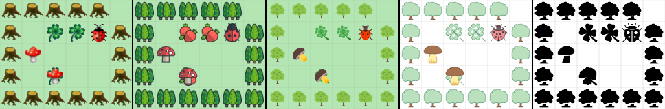

# Sokoban (Kara)

Für diese Umgebung wurde [JavaScriptKara](http://www.swisseduc.ch/informatik/karatojava/javascriptkara/) von SwissEduc neu implementiert.



Die Umgebung wird wie folgt eingesetzt:

```js
window.onload = function () {
	w = 32; //cellsize in px
	margin = 2; //margin inside cell in px
	wait = 800; //wait between each move and turn of kara in ms
	style = "flaticon"; // use: classic, flaticon, icon8_color, icon8_ios or icon8_office

	/*
		#: Baum
		@: Kara
		.: Kleeblatt (Erdbeere)
		$: Fliegenpilz
		*: Fliegenpilz auf einem Kleeblatt (Erdbeere)
		+: Kara auf einem Kleeblatt (Erdbeere)
	
	*/
	// Alle Leerzeichen vor der Welt werden als leere Felder interpretiert.
	karasworld = `world:
#####
# .. #
# @$ #
# *  #
######`

    //Alle vorherigen Einstellungen sind optional. 
    // Der folgende Befehl muss ausgeführt werden:
	setup();
}

/*
kara
	Sensoren: onLeaf(), treeFront(), treeLeft(), treeRight(), mushroomFront()
	Aktoren: move(), turnLeft(), turnRight(), putLeaf(), removeLeaf()
*/
function run() {
	kara.move();
	kara.turnLeft();
	kara.move();
	if (kara.onLeaf()) {
		kara.removeLeaf();
	}
	if (kara.treeFront()) {
		kara.turnRight();
		kara.move();
	}
	if (kara.treeLeft()) {
		kara.putLeaf();
		kara.turnRight();
		kara.move();
	}
}
```

Die Syntax um eine Welt für Kara zu erstellen ist mit [GreenfootKara](https://github.com/marcojakob/greenfoot-kara) kompatibel.