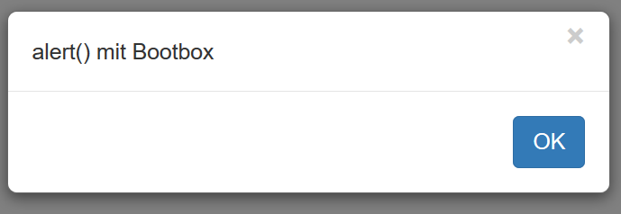

# Dialoge

Eine oft verwendete Möglichkeit, um ohne eine GUI zu programmieren Benutzereingaben zu erhalten, ist es, dass Dialoge wie etwa `alert()` angezeigt werden. Da diese aus Sicherheitsgründen deaktiviert sind, kann hier eine alternative Implementierung durch [Bootbox.js](http://bootboxjs.com/) verwendet werden:



```js
bootbox.alert("alert() mit Bootbox");
```

Bootbox hat den Vorteil, dass es sich zum einen vom "Look and Feel" besser in die Webseite einfügt und zum anderen, dass es mehr Funktionen und Gestaltungsmöglichkeiten bietet.

[Hier sind die vielen Funktionen mit Beispielen](http://bootboxjs.com/examples.html) gut beschrieben.

Zur Vorbereitung auf spätere Aufgaben in Programmierumgebungen, können die Bootbox-Dialoge ähnlich der Konsolenausgabe auch mit den bekannten Befehlen ausgeführt werden:

```js
alert("alert() mit Bootbox");
```

Dazu müssen die benötigten Funktionen einfach wieder überschrieben werden:

```js
function alert(message) { 
    bootbox.alert(message);
} 

function prompt(message) { 
    bootbox.prompt(message, function(result){ return result; })
} 

function confirm(message) { 
    bootbox.confirm(message, function(result){ return result; })
} 
```

